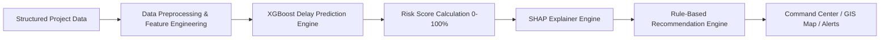
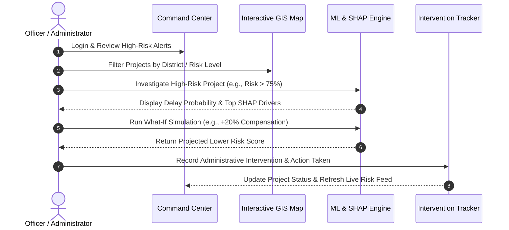

<div align="center">

# 🏛️ Land Acquisition Intelligence

### **AI-Powered Predictive Analytics for Early Detection of Land Acquisition Delays**

[](https://react.dev/)
[](https://www.python.org/)
[](https://fastapi.tiangolo.com/)
[](https://xgboost.readthedocs.io/)
[](https://shap.readthedocs.io/)
[](https://leafletjs.com/)
[](https://www.sqlite.org/)
[](#-current-mvp-vs-future-scope)

*Predicting delay vulnerabilities, explaining risk drivers with SHAP, and recommending targeted administrative interventions before project bottlenecks occur.*

</div>

---

## 📋 Table of Contents

- [Overview](#-overview)
- [Problem Statement](#-problem-statement)
- [Why This Matters](#-why-this-matters)
- [Why This Is More Than a Dashboard](#-why-this-is-more-than-a-dashboard)
- [Proposed Solution](#-proposed-solution)
- [Key Features](#-key-features)
- [How It Works](#-how-it-works)
- [System Workflow](#-system-workflow)
- [AI / ML Approach](#-ai--ml-approach)
- [Explainable AI (SHAP)](#-explainable-ai-shap)
- [Risk Scoring](#-risk-scoring)
- [GIS Intelligence](#-gis-intelligence)
- [Architecture](#-architecture)
- [Technology Stack](#-technology-stack)
- [Data Strategy](#-data-strategy)
- [Demo Scenario](#-demo-scenario)
- [Screenshots](#-screenshots)
- [Installation & Setup](#-installation--setup)
- [Project Structure](#-project-structure)
- [API / Backend Endpoints](#-api--backend-endpoints)
- [Expected Impact](#-expected-impact)
- [Current MVP vs Future Scope](#-current-mvp-vs-future-scope)
- [Challenges](#-challenges)
- [Future Enhancements](#-future-enhancements)
- [License & Acknowledgements](#-license--acknowledgements)

---

## 🔍 Overview

**Land Acquisition Intelligence** is an AI-driven decision support and early-warning platform designed for state and central government infrastructure departments, district collectors, and land acquisition officers. 

By analyzing historical timelines, structural legal bottlenecks, compensation progress, and departmental approval rates, the platform identifies high-risk infrastructure projects **months before delays occur**, explains *why* the delay is imminent using Explainable AI (SHAP), and prescribes targeted administrative interventions.

---

## 🚨 Problem Statement

Land acquisition is universally acknowledged as one of the most delay-prone and capital-intensive stages in infrastructure development (highways, railways, metro, irrigation). Projects suffer massive cost and schedule overruns due to:

- 💸 **Pending Compensation & Disbursement Gaps**
- ⚖️ **Legal Disputes & Court Litigation**
- 📜 **Ownership Verification & Land Record Ambiguity**
- 📑 **Incomplete Documentation & Verification**
- 🏚️ **Rehabilitation & Resettlement (R&R) Friction**
- 🤝 **Poor Inter-Departmental Coordination & Approval Bottlenecks**

Existing government portals primarily function as **status trackers** — recording delays *after* milestones have already been missed. There is no intelligent early-warning mechanism that predicts which land acquisition project is likely to be delayed, at what phase the breakdown will occur, why it is occurring, and what corrective action should be prioritized today.

---

## 🎯 Why This Matters

| Traditional Status Monitoring | Predictive AI Governance |
| :--- | :--- |
| **Reactive:** Registers a delay after deadlines pass | **Proactive:** Flags risk 60–120 days before deadlines miss |
| **Descriptive:** Shows "Compensation 40% Complete" | **Diagnostic:** Identifies compensation lag as the primary delay driver |
| **Manual Escalation:** Relies on periodic offline reviews | **Automated Alerts:** Triggers priority alerts for critical projects |
| **Generic Actions:** "Speed up acquisition" | **Prescriptive Interventions:** "Prioritize 3(A) notification & resolve Pune revenue disputes" |

---

## ⚡ Why This Is More Than a Dashboard

A conventional dashboard simply visualizes current project status using static pie charts and tables.

**Land Acquisition Intelligence** goes beyond visualization by creating a closed-loop intelligence engine:
1. **Predict:** Uses Machine Learning (XGBoost) to evaluate multi-variate project risk.
2. **Explain:** Uses SHAP (SHapley Additive exPlanations) to isolate the exact features pushing a project into high risk.
3. **Recommend:** Recommends concrete administrative interventions tailored to the top risk drivers.
4. **Act & Monitor:** Records officer actions and continuously updates risk scores to track intervention efficacy over time.

> **Core Philosophy:** `Predict → Explain → Recommend → Act → Monitor`

---

## 💡 Proposed Solution

An end-to-end early-warning platform that equips administrators to:
- 📊 **Predict Project Delay Probability:** Generate real-time continuous delay probabilities (0–100%).
- 🏷️ **Categorize Project Risk:** Group projects into **Low**, **Moderate**, **High**, and **Critical** risk tiers.
- 🎯 **Pinpoint Vulnerable Life-Cycle Stages:** Identify whether delays are rooted in Notification, Compensation, Rehabilitation, or Possession.
- 🔍 **Provide Explainable Risk Drivers:** Utilize SHAP feature attribution to reveal exact bottlenecks.
- ⚡ **Recommend Administrative Interventions:** Automatically prescribe targeted corrective actions.
- 🗺️ **GIS Risk Mapping:** Geographically visualize project risk zones via an interactive Leaflet map.
- 🔔 **Alert & Intervention Workflows:** Generate immediate alerts for critical projects and log administrative actions.

---

## ✨ Key Features

- **High-Risk Command Center:** Executive summary displaying active projects, critical alerts, average risk scores, and priority intervention feeds.
- **Predictive Analytics Registry:** Searchable, filterable project registry with district-level risk segmentation and sorting.
- **GIS Risk Map:** Interactive OpenStreetMap integration with color-coded geographic markers based on risk level.
- **What-If Intervention Simulator:** Interactive tool allowing officers to simulate how increasing compensation or resolving legal disputes lowers project risk before deploying real resources.
- **Explainable AI Drilldown:** Detailed breakdown of top positive and negative risk contributors for every project.
- **Learning Loop / Feedback System:** Interface for administrators to record completed interventions and update project state.

---

## 🔄 How It Works



---

## 👥 System Workflow

The end-to-end operational workflow followed by administrators:



---

## 🤖 AI / ML Approach

The Machine Learning architecture is optimized for structured tabular land-acquisition data.

### ML Pipeline
1. **Raw Project Data Ingestion:** Historical & current project data.
2. **Preprocessing:** One-hot encoding for categorical variables (District, Project Type) and standard scaling for numerical features.
3. **Model Selection:**
   - *Baseline Model:* Logistic Regression
   - *Alternative Evaluated:* Random Forest
   - *Production Choice:* **XGBoost Classifier** (selected for superior handling of non-linear tabular feature interactions).
4. **Output Generation:** Probabilistic delay output converted into a 0–100 Risk Score.

### Primary Model Features
- **Project Characteristics:** `project_type`, `total_acres`, `affected_families`
- **Acquisition Progress:** `land_acquired_pct`, `compensation_disbursed_pct`, `possession_pct`
- **Legal & Administrative Constraints:** `legal_cases_count`, `ownership_disputes`, `approval_days_pending`, `doc_deficiency_score`
- **Rehabilitation & Historical Benchmarks:** `rnp_progress_pct`, `historical_district_delay_avg`

---

## 🔬 Explainable AI (SHAP)

To build trust with government decision-makers, model outputs cannot be a "black box." The MVP incorporates **SHAP (SHapley Additive exPlanations)** via `shap.TreeExplainer`.

For every project prediction, the backend calculates exact SHAP values to attribute feature contributions:

```python
# Extracting top SHAP drivers in backend/ml/explainer.py
explainer = shap.TreeExplainer(model)
shap_values = explainer.shap_values(input_array)
```

### Example SHAP Breakdown Output:
- **Delay Risk:** `82%` (Critical)
- **Top SHAP Risk Drivers:**
  1. `Compensation Disbursed % (35%)` ➔ **+0.28 risk contribution**
  2. `Legal Cases Count (4 cases)` ➔ **+0.19 risk contribution**
  3. `Approval Days Pending (120 days)` ➔ **+0.14 risk contribution**

---

## 📊 Risk Scoring

Project risk is normalized to a **0–100 Scale** and categorized into four administrative action bands:

| Risk Score | Category | Color | Required Administrative Action |
| :---: | :---: | :---: | :--- |
| **0 – 25** | **Low** | 🟢 Green | Routine periodic monitoring. |
| **26 – 50** | **Moderate** | 🟡 Yellow | Bi-weekly district level review. |
| **51 – 75** | **High** | 🟠 Orange | Inter-departmental escalation & priority review. |
| **76 – 100** | **Critical** | 🔴 Red | **Immediate District Collector intervention required.** Alert triggered. |

---

## 🗺️ GIS Intelligence

The GIS module integrates **Leaflet.js** and **OpenStreetMap** to geographically map land acquisition projects across districts.

- 📍 **Color-Coded Risk Pins:** Map markers match project risk tiers (Green, Yellow, Orange, Red).
- 🔵 **Intervention Logged State:** Pin turns blue once an official logs an active intervention.
- 🔍 **Spatial Clustering & Filters:** Filter projects by district, infrastructure type (Highway, Railway, Metro, Irrigation), and risk status.

---

## 🏗️ Architecture

```
                               ┌──────────────────────────────────────────┐
                               │             React 19 + Vite              │
                               │        (Command Center Frontend)         │
                               └────────────────────┬─────────────────────┘
                                                    │ REST API
                               ┌────────────────────▼─────────────────────┐
                               │           FastAPI Backend (v2.0)         │
                               └──────┬─────────────────┬───────────────┬─┘
                                      │                 │               │
                        ┌─────────────▼─────┐   ┌───────▼───────┐   ┌───▼───────────┐
                        │ SQLite / PostGIS  │   │ XGBoost Model │   │ SHAP Engine   │
                        │   (ORM Storage)   │   │ (.pkl Engine) │   │ (Explainer)   │
                        └───────────────────┘   └───────────────┘   └───────────────┘
```

---

## 💻 Technology Stack

### Frontend
- **Framework:** React 19 (Vite build engine)
- **Routing & State:** React Router v7, Axios
- **Styling & UI:** Tailwind CSS v4, Lucide React Icons
- **Visualization & Maps:** Recharts, Leaflet.js, React-Leaflet

### Backend & AI/ML
- **Language:** Python 3.13
- **Framework:** FastAPI v0.115, Uvicorn
- **Data & ML Libraries:** Pandas, NumPy, Scikit-learn, XGBoost, Joblib
- **Explainability:** SHAP 0.45.1
- **Database & ORM:** SQLAlchemy v2.0, SQLite (PostgreSQL/PostGIS ready)

---

## 🌐 Data Strategy

### Current Hackathon MVP
- **Data Source:** Representative structured dataset modeled after published state infrastructure project notification timelines, land acquisition act procedures (LARR Act 2013), and historical district completion metrics.
- **Format:** Synthetic tabular feature vectors mirroring real-world acquisition attributes to train and evaluate XGBoost models safely without compromising sensitive personal land records.

### Production Deployment Strategy
- **Integrations:**
  - State Land Records (Bhulekh / State Revenue Portals)
  - E-Courts Services API (legal dispute tracking)
  - Public Works Department (PWD) & Infrastructure PMIS Databases
  - Treasury & Compensation Payment Gateway systems
- **Spatial Infrastructure:** Integration with PostGIS for spatial queries and administrative boundary mapping.

---

## 🧪 Demo Scenario

```text
📌 Project ID: PRJ-2026-184
📍 District: Pune, Maharashtra
🛣️ Type: Express Highway Corridor Expansion
📉 Calculated Delay Probability: 82%
🚨 Risk Tier: CRITICAL

🔍 Identified Bottlenecks (SHAP Drivers):
   1. Compensation Disbursed: 28% (Threshold: 70%) ➔ High Impact (+0.31)
   2. Ownership Disputes: 14 pending cases ➔ Medium Impact (+0.18)
   3. Competent Authority Approval: 112 days pending ➔ Medium Impact (+0.12)

⚡ Prescribed Intervention:
   "Escalate compensation disbursement via Special Land Acquisition Officer (SLAO) Pune; Schedule fast-track revenue court hearings for 14 ownership disputes."

📝 Action Taken by District Collector:
   "Disbursement batch #4 released ($1.2M); Special camp scheduled for Pune village disputes."
   ➔ Status Updated to: Intervention Logged (Risk Re-calculated)
```

---

## 📸 Screenshots

*(Placeholder representations — add project screenshots to `docs/screenshots/`)*

| Command Center Dashboard | GIS Risk Map |
| :---: | :---: |
|  |  |

| Predictive Analytics & SHAP | Investigate & Act Workflow |
| :---: | :---: |
|  |  |

---

## ⚙️ Installation & Setup

### Prerequisites
- **Node.js:** `v18+` & `npm`
- **Python:** `v3.10+` (Python 3.11/3.13 recommended)

### 1. Clone Repository
```bash
git clone https://github.com/Pranav9949/Predictive-Analytics-System-for-Early-Detection-of-Land-Acquisition-Delays.git
cd Predictive-Analytics-System-for-Early-Detection-of-Land-Acquisition-Delays/land_acquisition_mvp
```

### 2. Backend Setup
```bash
cd backend

# Create and activate virtual environment
python -m venv venv
# On Windows:
venv\Scripts\activate
# On Linux/macOS:
source venv/bin/activate

# Install dependencies
pip install -r requirements.txt

# Start FastAPI server
python run.py
```
*Backend will start on `http://127.0.0.1:8000` (Swagger docs available at `/docs`).*

### 3. Frontend Setup
```bash
# In a new terminal window
cd land_acquisition_mvp/frontend

# Install dependencies
npm install

# Start Vite dev server
npm run dev
```
*Frontend will run locally at `http://localhost:5173`.*

---

## 📁 Project Structure

```text
land_acquisition_mvp/
├── backend/
│   ├── app/
│   │   ├── routes/          # API Routers (auth, predict, status, whatif, geo, alerts)
│   │   ├── database.py      # SQLAlchemy DB configuration
│   │   ├── models.py        # Database models
│   │   └── main.py          # FastAPI application entry point
│   ├── land_acquisition.db  # SQLite database instance
│   ├── requirements.txt     # Backend dependencies
│   └── run.py               # Uvicorn runner script
├── frontend/
│   ├── src/
│   │   ├── components/      # Reusable UI components (Navbar, Cards, Alerts)
│   │   ├── pages/           # Command Center, Analytics, GIS Map, Model Health
│   │   ├── services/        # Axios API client bindings
│   │   ├── App.jsx          # Main Router configuration
│   │   └── main.jsx         # React application root
│   ├── package.json         # Frontend dependencies & scripts
│   └── vite.config.js       # Vite configuration
└── ml/
    ├── delay_model.pkl      # Trained XGBoost model artifact
    ├── encoder.pkl          # One-Hot Encoder artifact
    ├── feature_columns.pkl  # Exact feature ordering list
    ├── explainer.py         # SHAP TreeExplainer wrapper
    └── train.py             # Model training & serialization pipeline
```

---

## 🔌 API / Backend Endpoints

The FastAPI backend exposes 8 operational endpoint categories:

| Method | Endpoint | Description |
| :---: | :--- | :--- |
| `GET` | `/health` | Server & ML artifact health status check |
| `GET` | `/predict/projects` | Fetch all project predictions with delay probabilities |
| `GET` | `/predict/{project_id}` | Detailed project prediction + SHAP driver analysis |
| `POST` | `/whatif/simulate` | Run What-If feature parameter simulations |
| `GET` | `/geo/projects` | Geolocation data formatted for Leaflet GIS mapping |
| `GET` | `/alerts/critical` | Fetch active critical-risk alerts feed |
| `POST` | `/status/intervene` | Record administrative action for a project |
| `POST` | `/feedback/log` | Submit feedback for model retraining |

---

## 🎯 Expected Impact

- ⏱️ **Early Bottleneck Detection:** Reduces average project delay duration by detecting friction points up to 6 months earlier.
- 🎯 **Targeted Governance:** Focuses limited administrative bandwidth on high-impact interventions (e.g., accelerating compensation vs resolving litigation).
- 💰 **Mitigating Overruns:** Prevents compounding financial interest and cost overruns on major infrastructure projects.
- 🤝 **Enhanced Transparency:** Provides an objective, data-backed standard for inter-departmental accountability.

---

## ⚖️ Current MVP vs Future Scope

| Feature Capability | Current MVP | Future Production Scope |
| :--- | :---: | :---: |
| **Prediction Engine** | XGBoost model on structured features | Ensemble ML + Time-Series Life-cycle models |
| **Explainability** | SHAP TreeExplainer integrated | Interactive SHAP Waterfall & Force plots |
| **GIS Mapping** | Leaflet + OpenStreetMap pin rendering | PostGIS spatial queries & satellite overlay |
| **Intervention Simulator** | Basic What-If parameter tweaking | Advanced multi-variable scenario simulator |
| **Data Ingestion** | Synthetic representative database | Direct integration with State Revenue APIs |
| **Alerting** | In-app notification feed | Automated SMS, WhatsApp & Email escalation |

---

## 🥊 Challenges

1. **Data Fragmentation:** Land records, legal disputes, and treasury disbursements are traditionally siloed across different state departments.
2. **Tabular Feature Variance:** Acquisition timelines vary significantly across urban vs. rural districts.
3. **Model Interpretability:** Translating complex mathematical SHAP contributions into simple, non-technical administrative recommendations.

---

## 🚀 Future Enhancements

- 🔮 **Stage-Wise Delay Prediction:** Predict exactly *which* lifecycle stage (e.g., 3(A) notification vs 3(G) compensation) will fail next.
- 📱 **Mobile App for Field Officers:** Enable Land Acquisition Officers to submit ground verification reports directly from the field.
- 🔄 **Automated Retraining Pipeline:** Continually retrain models as completed project timelines enter the database.
- 🔐 **Role-Based Access Control (RBAC):** Granular permissions for District Collectors, SLAOs, and State Secretariat users.

---

## 👥 Team

Built with ❤️ for **Smart India Hackathon (SIH) 2026**.

- **Pranav** - *Full Stack & ML Integration*

---

## 📄 License & Acknowledgements

This project is open-source under the [MIT License](LICENSE). 

*Acknowledgements: Built using open data frameworks, Scikit-learn, XGBoost, SHAP, FastAPI, and React.*
