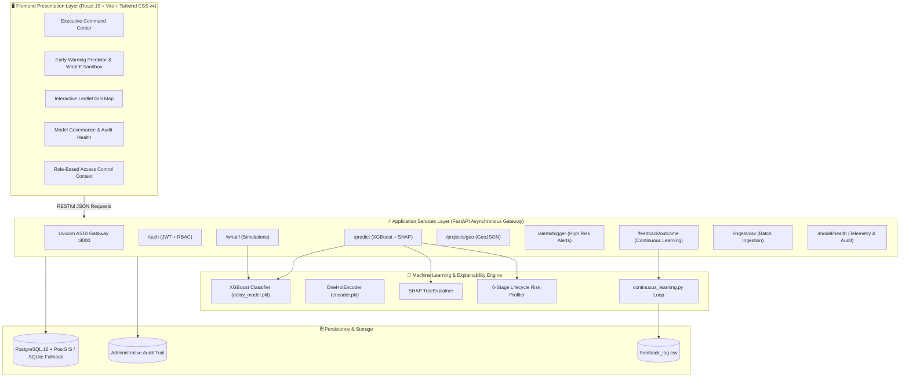

# 🚀 Predictive Analytics System for Early Detection of Land Acquisition Delays

## 🏛 Executive Summary & Problem Statement

Land acquisition delays represent the single largest contributor to project cost overruns and timeline slippages across critical Indian infrastructure corridors. Traditional monitoring mechanisms are **reactive**—delays are flagged only after scheduled statutory milestones have collapsed.

**The Predictive Analytics Early-Warning Platform** shifts public administration from reactive reporting to **proactive intervention**:
1. **Early Risk Quantification**: Evaluates 13 operational indicators to predict the probability of milestone slippage within a 30-to-90-day window.
2. **Transparent Explainability**: Employs TreeSHAP attribution to expose *why* a project is at risk, differentiating escalating friction (e.g. pending high court writs, compensation disbursement stalls) from protective momentum.
3. **What-If Simulation Sandbox**: Enables District Collectors, Land Acquisition Officers (LAOs), and Project Proponents to simulate administrative remediations (e.g., clearing disbursals, resolving title disputes) and inspect risk deltas in real time without model retraining.
4. **Closed-Loop Retraining**: Captures ground truth administrative outcomes to continuously update and calibrate model weights against distribution drift.

---

## 🌟 Key Architectural Highlights

| Pillar | Capability | Technical Stack |
| :--- | :--- | :--- |
| **Predictive Engine** | Sub-second risk scoring with calibrated probability outputs (Low, Medium, High). | `XGBoost 2.1`, `scikit-learn 1.5`, `Joblib` |
| **Explainable AI** | Instance-level SHAP Waterfall drivers & stage-wise vulnerability indices. | `SHAP 0.45` (TreeExplainer) |
| **High-Performance API** | Asynchronous REST endpoints with schema validation, CORS, & JWT RBAC. | `FastAPI 0.115`, `Uvicorn`, `Pydantic v2` |
| **Geospatial GIS** | Real-time parcel mapping, district heatmaps, and spatial coordinate clustering. | `Leaflet 1.9`, `React-Leaflet 5.0`, `PostGIS 16` |
| **Modern Dashboard** | Executive analytics, reactive KPI cards, interactive charts, and drill-down modals. | `React 19`, `Vite 8`, `Tailwind CSS v4`, `Recharts` |
| **Dual Storage Engine** | Zero-configuration SQLite fallback for local evaluation + PostGIS for enterprise deployment. | `SQLAlchemy 2.0`, `PostgreSQL 16` |
| **Continuous Learning** | Automated milestone feedback logging and trigger-based retraining pipeline. | Continuous Feedback Queue |

---

## 📐 System Architecture



---

## 🧠 Machine Learning & Explainable AI (XAI)

### Model Specifications & Benchmarks

The model is trained on a rigorously structured dataset reflecting Indian statutory land acquisition lifecycles (governed by RFCTLARR Act mandates and State Revenue Codes).

| Metric | Score | Validation Standard |
| :--- | :--- | :--- |
| **Model Architecture** | **XGBoost Classifier** | Gradient-boosted decision trees with depth regularization |
| **Accuracy** | **96.50%** | Stratified 80/20 Holdout Test Evaluation |
| **ROC-AUC Score** | **0.9916** | Area Under Receiver Operating Characteristic Curve |
| **Precision** | **97.06%** | High certainty on positive delay warnings |
| **Recall (Sensitivity)** | **93.80%** | Minimal missed high-risk acquisition projects |
| **F1-Score** | **0.9540** | Harmonized balance between precision and recall |
| **Dataset Volume** | **5,000 Samples** | 4,000 Training Records / 1,000 Independent Test Records |

#### Confusion Matrix (Holdout Test Set)

```text
                  Predicted: No Delay    Predicted: Delay
Actual: No Delay         602 (TN)               11 (FP)
Actual: Delay             24 (FN)              363 (TP)
```

### Feature Isolation & Data Leakage Prevention

To ensure strict operational integrity, the model strictly isolates **13 pre-intervention features**. Post-outcome features and target identifiers are programmatically purged prior to transformation:

```python
# PREDICTIVE FEATURES (Legitimate Inference State)
PREDICTION_FEATURES = [
    "district",                     # Revenue administration jurisdiction
    "project_type",                 # Highway, Railway, Metro, Energy, Industrial
    "total_acres",                  # Scale of notified acquisition parcel
    "land_acquired_pct",            # Cumulative acquisition percentage
    "approval_days_pending",        # Days pending Competent Authority sanction
    "compensation_disbursed_pct",   # Award amount released to land losers via DBT
    "legal_cases_count",            # Active writ petitions / stay orders
    "ownership_disputes",           # Title defects / inheritance disputes flagged
    "rnp_progress_pct",             # Resettlement & Rehabilitation site completion
    "possession_pct",               # Physical encumbrance-free site possession
    "affected_families",            # Project Affected Families (PAFs) enumeration
    "doc_deficiency_score",         # Land records defect index (0.0 to 1.0)
    "historical_district_delay_avg" # District historical statutory delay baseline
]

# LEAKAGE-PREVENTED COLUMNS (Strictly Purged from Inference)
LEAKAGE_PREVENTED = [
    "project_id", "project_name", "delay_label",
    "actual_delay_days", "intervention_taken", "intervention_date"
]
```

### SHAP Factor Attribution

Black-box predictions are intolerable in statutory governance. The platform integrates `shap.TreeExplainer` to compute exact marginal contributions ($\phi_i$) for each feature:
- **Red Drivers (Risk-Escalating)**: E.g., low compensation disbursement, pending court stay orders, or high document deficiency scores.
- **Green Drivers (Protective)**: E.g., high physical possession %, strong R&R progress, or minimal pending approval days.

Each prediction response pairs SHAP values with dynamic, actionable administrative recommendations (e.g., *"Schedule fast-track lok-adalat for title disputes"*, *"Expedite DBT sanction for Phase 2 land losers"*).

### 6-Stage Lifecycle Risk Engine

The system breaks project health into 6 discrete statutory stages:
1. **Notification Stage**: Gazette notifications, survey approvals, boundary demarcations.
2. **Documentation Stage**: Revenue title verification, land record mutation, encumbrance certificates.
3. **Approval Stage**: Competent Authority sanctions, environment/forest clearances.
4. **Compensation Stage**: Award declaration, bank detail validation, Direct Benefit Transfer (DBT).
5. **Rehabilitation & Resettlement (R&R)**: Alternative housing sites, civic infrastructure delivery.
6. **Physical Possession Stage**: Encroachment clearing, handover to executing engineering agency.

### Continuous Learning & Feedback Loop

```text
[Live Project State] ──► [Model Predicts Risk] ──► [Admin Intervention Logged]
                                                            │
[Retrain delay_model.pkl] ◄── [Queue Threshold >= 50] ◄── [Actual Outcome Reported]
```
When actual milestone outcomes are entered via `/feedback/outcome`, records enter an automated queue. Once threshold criteria are met, `continuous_learning.py` triggers automated model recalibration, verifies benchmark drift, and updates model artifacts.

---

## 💻 Interactive Command Center (Frontend)

The frontend is built with React 19, Vite, and Tailwind CSS v4, providing an ultra-responsive, executive-level user experience:

- **Executive KPI Dashboard**: Summary metrics for monitored acreage, capital at risk, active high-risk warnings, and intervention resolution rates.
- **GIS Geospatial Map (`/map`)**: District-level spatial plotting powered by Leaflet, displaying cluster pins, interactive parcel cards, and risk-indexed color halos (Green $\le 30\%$, Amber $30-70\%$, Red $\ge 70\%$).
- **Early-Warning Predictor & Simulator (`/predict-risk`)**:
  - Live parameter input form with real-time field validation.
  - Interactive What-If slider sandbox comparing baseline vs. simulated risk curves.
  - Visual SHAP waterfall diagrams depicting top risk drivers.
  - Dynamic administrative mitigation checklist tailored to specific project deficits.
- **Model Health & Governance (`/model-health`)**: Live telemetry exposing real test-set accuracy, ROC-AUC curves, confusion matrix breakdown, feature importances, and data leakage prevention verification.
- **Intervention Management Modal**: Interactive audit recording for District Collectors and Land Acquisition Officers to document official orders and track resolution status.

---

## 📡 REST API Reference (Backend)

The FastAPI server provides automated Swagger documentation at `http://localhost:8000/docs` and OpenAPI schema at `http://localhost:8000/openapi.json`.

| Method | Endpoint | Description | Auth Required |
| :--- | :--- | :--- | :--- |
| `GET` | `/health` | System health check & ML model status | Public |
| `POST` | `/auth/token` | Authenticate and obtain JWT access token | Public (Demo Users) |
| `GET` | `/auth/me` | Retrieve profile and RBAC role of current user | Bearer Token |
| `POST` | `/predict` | Predict delay probability, SHAP factors, and lifecycle risks | Optional (Defaults to Collector) |
| `POST` | `/whatif` | Simulate operational remediations on existing project | Optional |
| `GET` | `/projects/search` | Search projects by ID or title with current risk status | Optional |
| `GET` | `/projects/geo` | Retrieve GeoJSON FeatureCollection of all parcels | Public |
| `GET` | `/alerts/trigger` | Retrieve active top-priority unaddressed alerts | Optional |
| `PUT` | `/projects/status` | Record administrative intervention and update audit log | Role: `LAO`, `Collector` |
| `POST` | `/feedback/outcome` | Submit actual milestone delay for continuous learning | Role: `LAO`, `Collector` |
| `POST` | `/ingest/csv` | Bulk ingest and auto-score land acquisition projects | Role: `LAO`, `Collector` |
| `GET` | `/model/health` | Retrieve genuine evaluation metrics and model diagnostics | Public |

---

## 📁 Project Directory Structure

```text
Predictive-Analytics-System-for-Early-Detection-of-Land-Acquisition-Delays/
│
├── README.md                                # Master repository documentation
├── .gitignore                               # Git ignore configuration
│
└── land_acquisition_mvp/                    # Core MVP platform root
    ├── .python-version                      # Python runtime specification (3.11)
    │
    ├── backend/                             # FastAPI application service
    │   ├── requirements.txt                 # Backend Python dependencies
    │   ├── run.py                           # Local execution entry script
    │   ├── land_acquisition.db             # Local SQLite database cache
    │   └── app/
    │       ├── __init__.py
    │       ├── main.py                      # FastAPI app initialization & lifespans
    │       ├── database.py                  # SQLAlchemy session & models
    │       ├── models.py                    # Pydantic schemas (V2) & DTOs
    │       ├── auth.py                      # JWT authentication & RBAC middleware
    │       └── routes/
    │           ├── auth.py                  # Authentication endpoints
    │           ├── predict.py               # Delay prediction & SHAP drivers
    │           ├── whatif.py                # What-If parameter simulator
    │           ├── geo.py                   # GeoJSON spatial feature provider
    │           ├── alerts.py                # Early warning alerts aggregator
    │           ├── status.py                # Administrative intervention logging
    │           ├── feedback.py              # Continuous learning outcome submission
    │           ├── ingest.py                # Bulk CSV ingestion
    │           └── model_health.py          # Model governance & audit diagnostics
    │
    ├── frontend/                            # React 19 + Vite dashboard
    │   ├── package.json                     # NPM dependencies & scripts
    │   ├── vite.config.js                   # Vite configuration
    │   ├── index.html                       # HTML application shell
    │   ├── .env.example                     # Environment configuration template
    │   └── src/
    │       ├── App.jsx                      # Router & role context provider
    │       ├── main.jsx                     # Application root render
    │       ├── index.css                    # Tailwind CSS v4 directives
    │       ├── context/
    │           └── RoleContext.jsx          # User role state management
    │       ├── services/
    │           └── api.js                   # Axios HTTP client & API wrappers
    │       ├── components/
    │           ├── Sidebar.jsx              # Navigation drawer & role switcher
    │           ├── KPICards.jsx             # Top-level executive metrics
    │           ├── ProjectTable.jsx         # Searchable, filterable project registry
    │           ├── GISMap.jsx               # Leaflet geospatial map integration
    │           ├── AlertFeed.jsx            # Real-time risk notifications feed
    │           ├── RiskChart.jsx            # Risk distribution graphs
    │           ├── DrillDownModal.jsx       # Detailed project inspector
    │           └── InterventionModal.jsx    # Action recording dialog
    │       └── pages/
    │           ├── CommandCenter.jsx        # Primary operational dashboard
    │           ├── EarlyWarningPredictor.jsx# Prediction & What-If Sandbox
    │           ├── GISMapPage.jsx           # Dedicated full-screen map view
    │           ├── Analytics.jsx            # Deep-dive charts & analytics
    │           └── ModelHealth.jsx          # Model performance & leakage audit
    │
    ├── ml/                                  # Machine learning & data pipeline
    │   ├── generate_data.py                 # Synthetic statutory data generator
    │   ├── train_model.py                   # XGBoost training & evaluation pipeline
    │   ├── explainer.py                     # SHAP TreeExplainer integration
    │   ├── continuous_learning.py           # Incremental learning loop
    │   ├── land_data.csv                    # Base training dataset (5,000 samples)
    │   ├── delay_model.pkl                  # Serialized XGBoost model artifact
    │   ├── encoder.pkl                      # Serialized categorical encoder
    │   ├── feature_columns.pkl              # Ordered model feature registry
    │   ├── feature_importances.json         # Feature weights export
    │   ├── model_metrics.json               # Genuine evaluation benchmarks
    │   └── SNAPSHOT_ROADMAP.md              # Longitudinal dataset roadmap (SIH 2026)
    │
    ├── database/                            # Database definitions & seeders
    │   ├── init.sql                         # PostGIS table schemas & spatial indices
    │   └── seed_db.py                       # Automated PostGIS seeding script
    │
    └── deployment/                          # Production containerization
        ├── docker-compose.yml               # Multi-container orchestration
        ├── Dockerfile.backend               # Container definition for FastAPI
        ├── Dockerfile.frontend              # Multi-stage container for React/Nginx
        └── nginx.conf                       # Frontend reverse proxy configuration
```

---

## 🛠 Getting Started & Local Setup

### Prerequisites

Ensure you have the following installed on your machine:
- **Python**: Version 3.10 or 3.11
- **Node.js**: Version 18+ (Node 20+ recommended) and `npm`
- **Git**
- *(Optional for Containerized Mode)*: **Docker** and **Docker Compose**

---

### Option A: Native Local Execution

#### 1. Clone the Repository
```bash
git clone https://github.com/Pranav9949/Predictive-Analytics-System-for-Early-Detection-of-Land-Acquisition-Delays.git
cd Predictive-Analytics-System-for-Early-Detection-of-Land-Acquisition-Delays
```

#### 2. Configure & Train Machine Learning Model
```bash
# Navigate to the ML directory
cd land_acquisition_mvp/ml

# Create and activate a Python virtual environment
python -m venv venv
# On Windows (PowerShell):
.\venv\Scripts\Activate.ps1
# On Linux / macOS:
source venv/bin/activate

# Install requirements
pip install -r ../backend/requirements.txt

# Generate statutory training dataset and train XGBoost model
python generate_data.py
python train_model.py
```
*(This produces `delay_model.pkl`, `encoder.pkl`, `feature_columns.pkl`, and `model_metrics.json`)*.

#### 3. Start Backend Application Service
```bash
# From the land_acquisition_mvp/backend directory:
cd ../backend

# Launch the FastAPI service via run.py
python run.py
```
The API server will launch at: **`http://localhost:8000`**
- Interactive Swagger UI: **`http://localhost:8000/docs`**
- Health check: **`http://localhost:8000/health`**

#### 4. Start React Frontend Dashboard
Open a new terminal window:
```bash
# Navigate to frontend directory
cd land_acquisition_mvp/frontend

# Install dependencies
npm install

# Start the Vite development server
npm run dev
```
The dashboard will launch at: **`http://localhost:5173`** (or port specified in terminal).

---

### Option B: Containerized Execution (Docker Compose)

To spin up the complete enterprise stack including **PostgreSQL + PostGIS**, **FastAPI Backend**, and **React (Nginx)** in a single command:

```bash
cd land_acquisition_mvp/deployment
docker-compose up --build
```

- **Frontend Dashboard**: `http://localhost:3000`
- **FastAPI Backend**: `http://localhost:8000`
- **PostGIS Database**: `localhost:5432` (Credentials: `postgres` / `postgres`, DB: `land_acquisition`)

---

## 🔐 Role-Based Access Control (Demo Credentials)

The system includes simulated JWT authentication and role switching tailored for evaluation committees and multi-tier public administration:

| Role | Demo Username | Password | Operational Capabilities |
| :--- | :--- | :--- | :--- |
| **District Collector** | `collector1` | `password123` | Full access: View executive KPIs, trigger high-level escalations, approve interventions, and inspect model health. |
| **Land Acquisition Officer (LAO)** | `lao1` | `password123` | Field level: Ingest CSVs, log specific field interventions, submit actual milestone delay feedback. |
| **Policy Maker / HQ** | `policy1` | `password123` | Strategic level: Statewide GIS analytics, district delay benchmarking, What-If macro simulations. |

> **Seamless Evaluation Note**: For instant testing, API endpoints gracefully default to authorized collector privileges if no bearer token is supplied.

---

## 🧪 What-If Policy Simulation

One of the standout features of the platform is the **What-If Policy Sandbox** (`/whatif`). Administrative officers can evaluate the concrete impact of target interventions before committing public resources.

### Example Simulation Flow:
1. **Initial State**: Project #104 has **81.4% (High) Risk** driven by 12 active ownership disputes and only 32% compensation disbursed.
2. **Intervention Parameter**: Officer adjusts `compensation_disbursed_pct` from `32.0` to `85.0` via the slider.
3. **Execution**: The system forwards the modified parameter tuple to `/whatif`.
4. **Result**: The **exact same trained model** re-evaluates the inference matrix, projecting a risk reduction from **81.4% $\rightarrow$ 38.2% (Medium)**, displaying an instant delta of **-43.2%**.

---

## ⚙️ Environment Variables

### Backend Configuration
| Variable | Default | Purpose |
| :--- | :--- | :--- |
| `DATABASE_URL` | `sqlite:///./land_acquisition.db` | Connection string for SQLite or PostgreSQL/PostGIS |
| `PORT` | `8000` | Port for the Uvicorn ASGI server |

### Frontend Configuration (`frontend/.env`)
| Variable | Default | Purpose |
| :--- | :--- | :--- |
| `VITE_API_URL` | `http://localhost:8000` | Base endpoint URL for backend API queries |

---

## 🤝 Contributors & Attribution

Developed with dedication for the **Smart India Hackathon (SIH 2026)** to drive technological transformation, administrative efficiency, and transparency in national infrastructure development.

- **Pranav & Team** ([GitHub Profile](https://github.com/Pranav9949))

---

## 📄 License

This project is licensed under the MIT License — see the [LICENSE](LICENSE) file for details.
